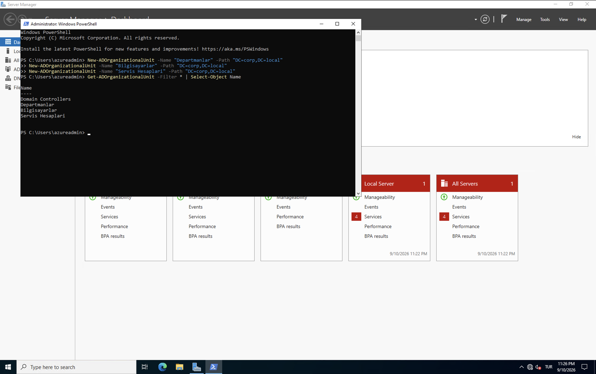
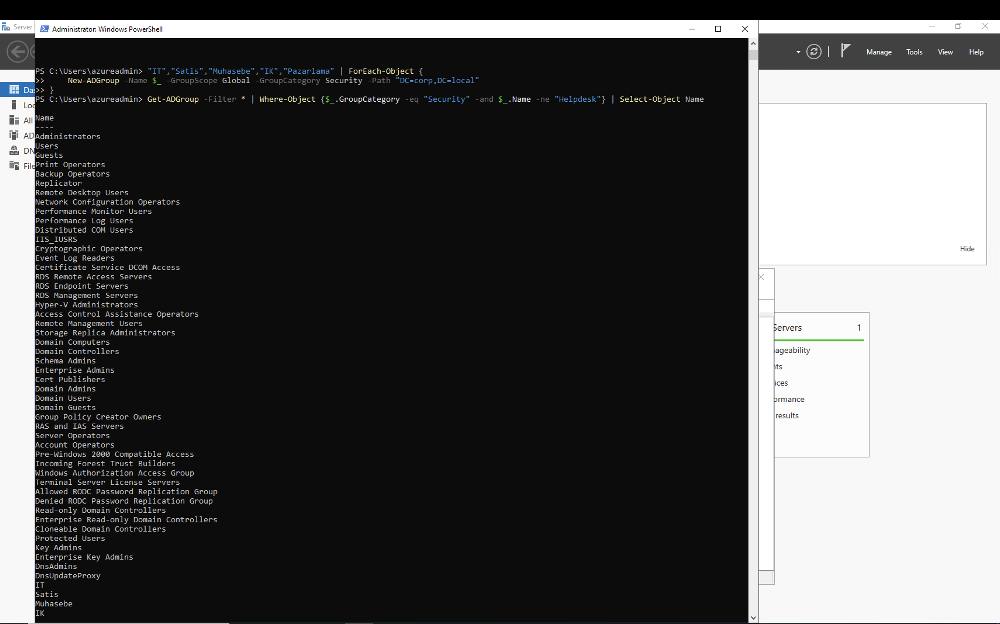
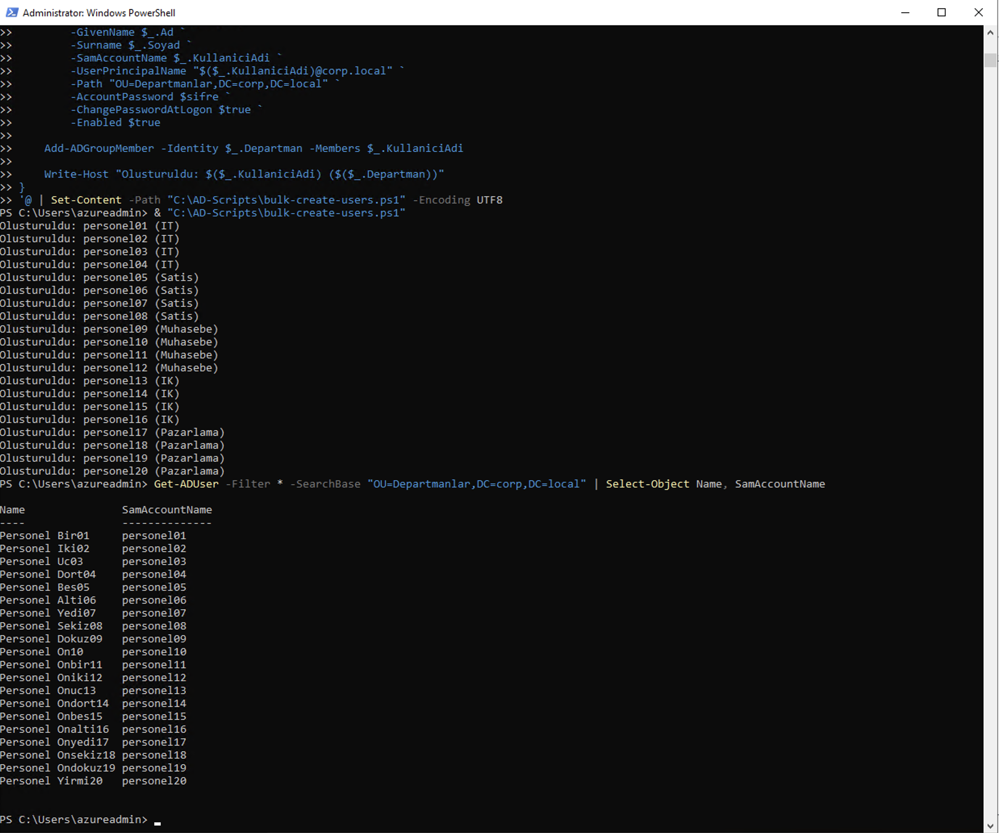

# PowerShell IT Ops Toolkit

30 günlük IT hazırlık sürecimde yazdığım PowerShell script'lerini topladığım repo. Zamanla büyüyecek, şimdilik tek script var.

İlgili lab ortamı için bkz. [windows-ad-helpdesk-lab](https://github.com/erencatak/windows-ad-helpdesk-lab).

## bulk-create-users.ps1

Bir CSV dosyasından okuyup Active Directory'de toplu kullanıcı açan script. Her kullanıcıyı OU'ya yerleştiriyor, ilgili departman grubuna ekliyor.

**CSV formatı** (`sample-data/yeni-kullanicilar.csv`'de örneği var, isimler kurgusal):

```
Ad,Soyad,KullaniciAdi,Departman
Personel,Bir01,personel01,IT
...
```

**Kullanım:**

```powershell
& "scripts\bulk-create-users.ps1"
```

(Script içindeki CSV yolu ve OU yolu şu an kendi lab ortamıma göre sabit yazılı — `C:\AD-Scripts\yeni-kullanicilar.csv` ve `OU=Departmanlar,DC=corp,DC=local`. Başka bir ortamda kullanacaksan bunları değiştirmen lazım.)

Çalıştırınca:







20 kişiyi tek komutla açtım, 1 kişiyi de karşılaştırmak için GUI'den elle açtım — o kısım [windows-ad-helpdesk-lab reposundaki Runbook #1](https://github.com/erencatak/windows-ad-helpdesk-lab/blob/main/RUNBOOK-01-yeni-calisan.md)'de.
